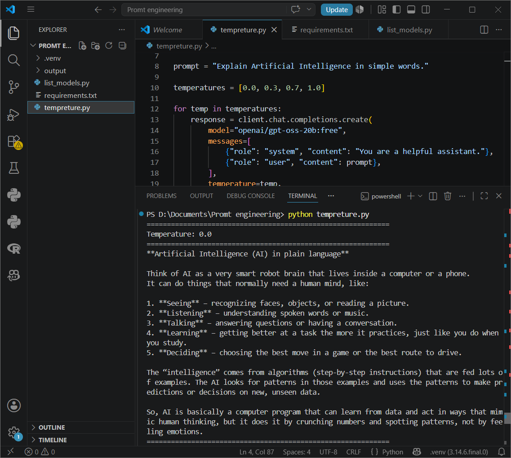
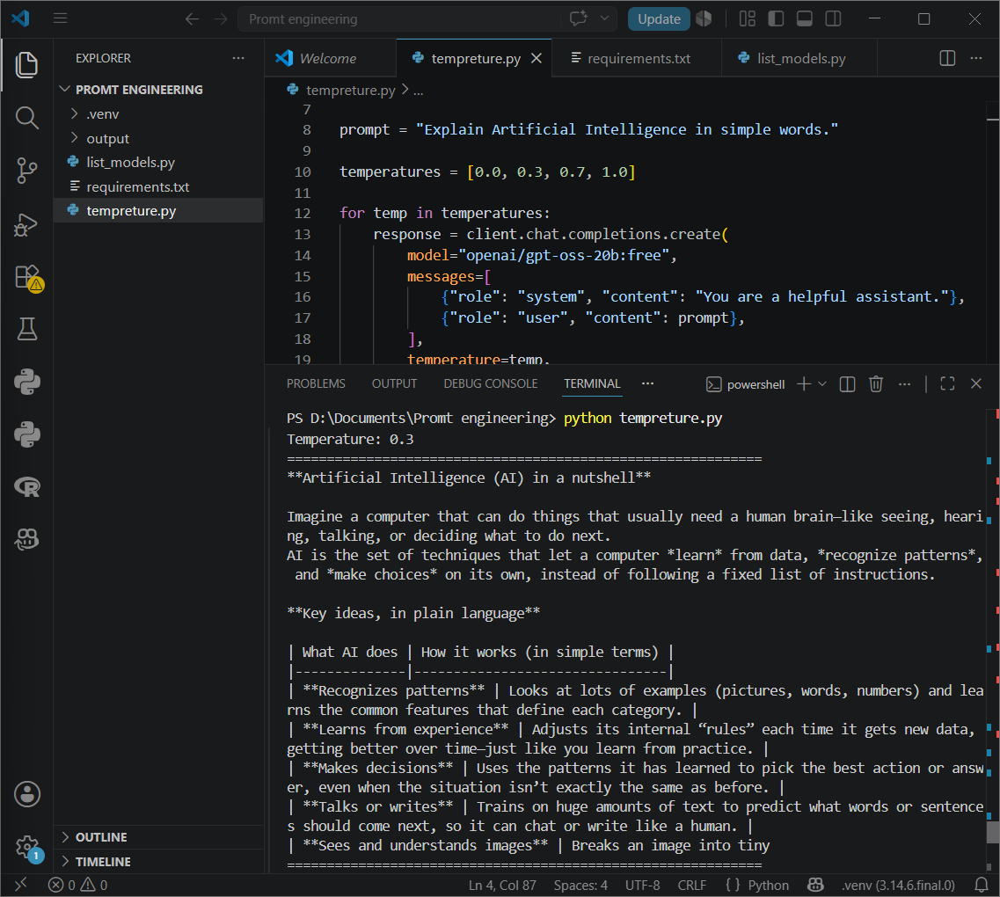
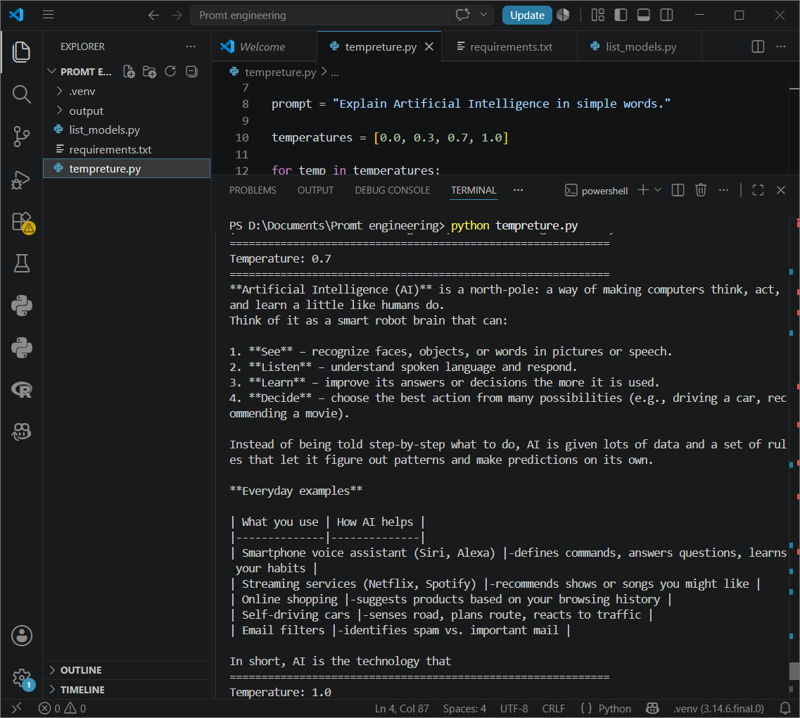
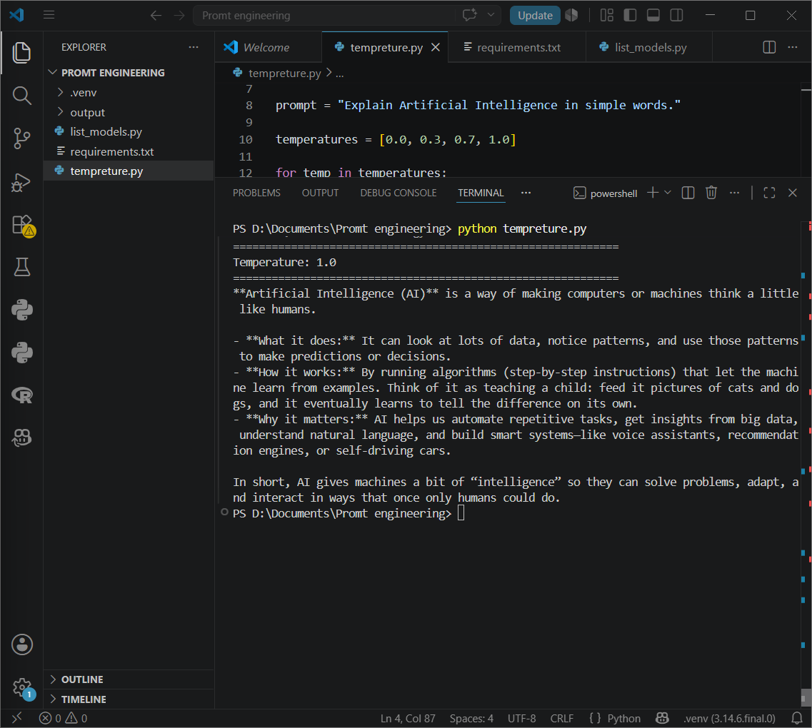

# Prompt Engineering - Temperature Demo

## Project Overview

This project demonstrates how the **Temperature** parameter affects the responses generated by a GPT model using the OpenRouter API.

Temperature controls the creativity and randomness of AI responses.

---

## Student Information

**Name:** Sai Kiran Gite

**Subject:** Prompt Engineering

---

## Objective

Generate responses using different temperature values and compare the outputs.

---

## Technologies Used

- Python 3
- OpenAI Python SDK
- OpenRouter API
- GPT OSS 20B (Free)

---

## Installation

Clone this repository

```bash
git clone https://github.com/sai292-cell/Prompt-Engineering-Temperature-Demo.git
```

Install dependencies

```bash
pip install -r requirements.txt
```

---

## Configure API Key

Create a `.env` file.

```
OPENROUTER_API_KEY=YOUR_API_KEY
```

---

## Run

```bash
python tempreture.py
```

---

##  Prompt Used

```
Explain Artificial Intelligence in simple words.
```

---

## Temperature Values

| Temperature | Behaviour |
|-------------|-----------|
| 0.0 | Deterministic |
| 0.3 | Slightly Creative |
| 0.7 | Balanced |
| 1.0 | Highly Creative |

---

# Output

## Temperature 0.0



---

## Temperature 0.3



---

## Temperature 0.7



---

## Temperature 1.0



---

# Observation

- Temperature **0.0** gives consistent and factual responses.
- Temperature **0.3** adds slight variation.
- Temperature **0.7** balances creativity and accuracy.
- Temperature **1.0** produces more creative and diverse responses.

---

# Conclusion

The **temperature parameter** controls the randomness and creativity of AI-generated text.

- Low temperature → More deterministic
- High temperature → More creative

---

## License

This project is created for educational purposes.